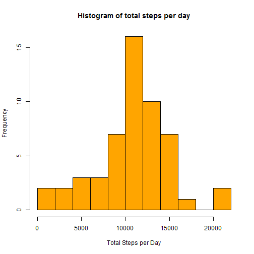
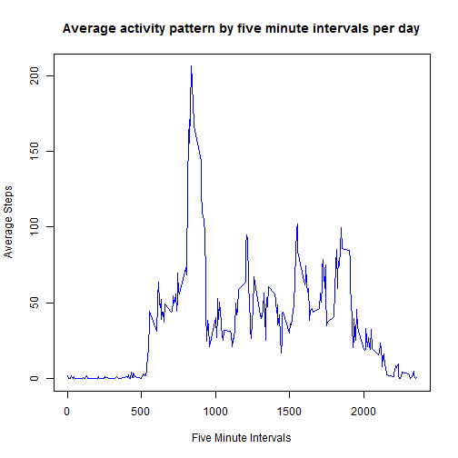
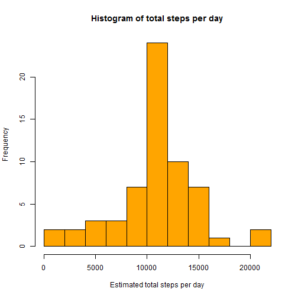
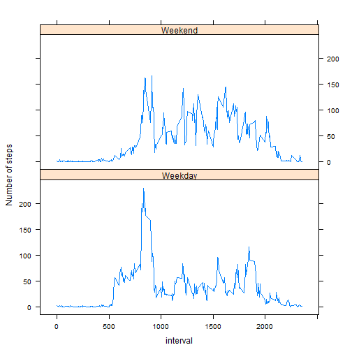

20150215 - Activity Monitoring / Reproducible Research - Assignment 1
========================================================
  
### 1. Load and examine the data.
  Notes: After loading and examining the data, I prefered to transform the date variable from a factor into a date type

```r
library(dplyr)
```

```
## 
## Attaching package: 'dplyr'
## 
## The following objects are masked from 'package:stats':
## 
##     filter, lag
## 
## The following objects are masked from 'package:base':
## 
##     intersect, setdiff, setequal, union
```

```r
df.activitydata<-read.csv("C:/Users/Joel/Documents/R/ReproRes/A1/activity.csv")
str(df.activitydata)
```

```
## 'data.frame':	17568 obs. of  3 variables:
##  $ steps   : int  NA NA NA NA NA NA NA NA NA NA ...
##  $ date    : Factor w/ 61 levels "2012-10-01","2012-10-02",..: 1 1 1 1 1 1 1 1 1 1 ...
##  $ interval: int  0 5 10 15 20 25 30 35 40 45 ...
```

```r
df.activitydata$date<-as.Date(df.activitydata$date, format="%Y-%m-%d")
```

### 2 What is mean total number of steps taken per day?
Notes: Distribution appears normal, thus mean and median are approximate to each other (10766 steps per day)

```r
library(ggplot2)
## 1. Calculate the total number of steps taken per day
agg.activitydata <- aggregate( steps ~ date, data=df.activitydata, FUN=sum)

## 2. Histogram of the total number of steps taken each day
hist(agg.activitydata$steps,
     breaks=10,
     col="orange",
     main="Histogram of total steps per day",
     xlab="Total Steps per Day")
```

 

```r
##3. Calculate and report the mean and median of the total number of steps taken per day
mean(agg.activitydata$steps)
```

```
## [1] 10766.19
```

```r
median(agg.activitydata$steps)
```

```
## [1] 10765
```

### 3 What is the average daily activity pattern? 
Notes: The procedure entailed calculating the average steps per interval (across all days), then plotting how much walking/running activity occurred on average per interval. In summary:
  1. Very little activity up to the 500 minute mark
2. an explosion of activity (including the highest interval of activity around the 835 minute mark of 206 steps)
3. A dramatic fall in activity followed by a steady amount of activity (between 40-70 steps) before the 2000 min mark
4. A steady fall in activity for the rest of the day.

```r
##1. What is the average daily activity pattern?
interval.average.steps.per.interval <- aggregate( steps ~ interval, data=df.activitydata, FUN=mean)

plot(
  interval.average.steps.per.interval$interval,
  interval.average.steps.per.interval$steps,
  type="l",
  col="blue",
  main="Average activity pattern by five minute intervals per day",
  xlab="Five Minute Intervals",
  ylab="Average Steps"
)
```

 

```r
##2. Which 5-minute interval, on average across all the days in the dataset, contains the maximum number of steps?
subset(interval.average.steps.per.interval, interval.average.steps.per.interval$steps==max(interval.average.steps.per.interval$steps))
```

```
##     interval    steps
## 104      835 206.1698
```

### 4 Dealing With Missing Data? 
Notes: 
  1. The number of missing values were calculated then substituted 
2. with the calculated average number of steps normally experienced within a given interval. A tidy dataset created 
3. provided the foundation of generating a histogram. As calculated averages were used, the histogram exhibited a normal distribution, with means, medians (10766) and distributions equivalent/identical to the previous uncleaned dataset previously.
4. Thus the impact of substituting averages to remove potential bias was negligble. 

```r
## 1. Calculate and report the total number of missing values in the dataset (i.e. the total number of rows with NAs)
length(which(is.na(df.activitydata$steps) == TRUE))
```

```
## [1] 2304
```

```r
## 2. Devise a strategy for filling in all of the missing values in the dataset.
## 2A Calculate average steps for each interval across all days
interval.average.steps.per.interval <- aggregate(steps ~ interval, data=df.activitydata, FUN=mean)

## 2B Find NA values in steps, then replace (using join query) with respective interval averages calculated from 2A above
df.activitydata2<- left_join(df.activitydata, interval.average.steps.per.interval) %>% 
  mutate(steps=ifelse(is.na(steps)==TRUE, interval.average.steps.per.interval$steps, steps)) %>%
  select(-interval.average.steps.per.interval$steps) 
```

```
## Joining by: c("steps", "interval")
```

```r
## 2C Make a tidy dataset.
tidy.activitydata<-data.frame(df.activitydata2, interval=df.activitydata$interval)
rm(df.activitydata2)
rm(interval.average.steps.per.interval)

## 3. Make a histogram of the total number of steps taken each day and Calculate and report the mean and median total     ## number of steps taken per day. Do these values differ from the estimates from the first part of the assignment? What 
## is the impact of imputing missing data on the estimates of the total daily number of steps?
agg.activitydata <- aggregate( steps ~ date, data=tidy.activitydata, FUN=sum)

hist(agg.activitydata$steps,
     breaks=10,
     col="orange",
     main="Histogram of total steps per day",
     xlab="Estimated total steps per day")
```

 

```r
mean(agg.activitydata$steps)
```

```
## [1] 10766.19
```

```r
median(agg.activitydata$steps)
```

```
## [1] 10766.19
```

```r
## Note: The impact of missing data on the estimates of the total daily number of steps is negligible. Means, Medians, 
## and distributions are not impacted in the slightest and are close to being identical.
```

### 5 Is there a difference in the number of steps walked/ran when comparing weekend to weekday data? 
Notes: Seems to be greater/higher variance during the weekend, thus more activity. Uncertain if these levels differ significantly

```r
library(lubridate)
tidy.activitydata<-tidy.activitydata %>% 
  mutate(day=as.factor(ifelse(wday(date) %in% c(1,7),"Weekend","Weekday")))

library(lattice)
tidy.activitydata<- tidy.activitydata %>% 
  group_by(day,interval) %>%
  summarise(meansteps=mean(steps))
with (tidy.activitydata, 
      xyplot(meansteps ~ interval|day, type="l", 
             ylab="Number of steps",layout=c(1,2)))
```

 


